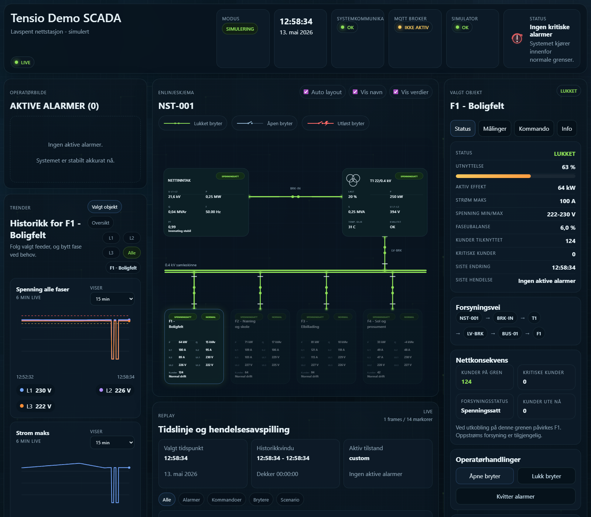
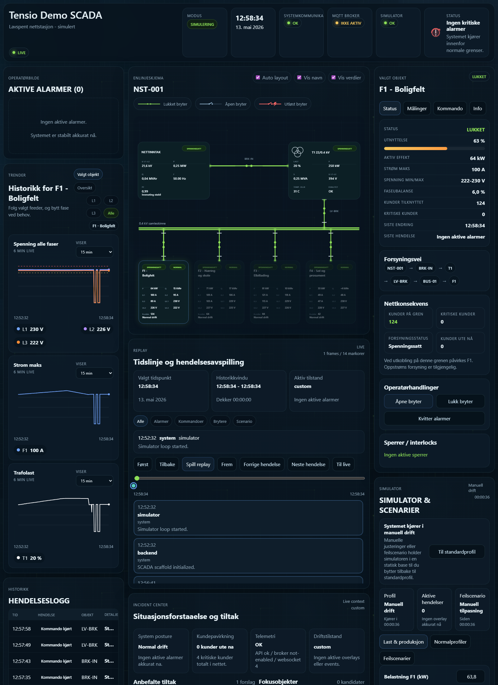

# Tensio Demo SCADA


SCADA-inspired operator dashboard for a simulated low-voltage distribution station.

This repository is built as a portfolio and demo project for grid monitoring, switching awareness, alarm handling, replay, and simulator-driven operator workflows. It is intentionally local, self-contained, and safe: it must never be connected to or used for real electrical control.

## UI Preview





## What This Project Demonstrates

- A live operator dashboard with a single-line diagram, selected-object detail, alarms, event log, trends, replay, and incident guidance
- A backend that owns topology, telemetry snapshots, alarm state, conservative switching logic, and report data
- A simulator that can run steady-state profiles, timed operating events, and explicit fault scenarios
- Safe command handling with interlocks, audit trail, and impact-aware switching flows
- A frontend that stays responsive while telemetry, alarms, and trend history update continuously

## Core Capabilities

### Operator View

- SCADA-style dashboard layout with live system status and selected-object drilldown
- SVG-based one-line diagram with feeder breakers, `BRK-IN`, `LV-BRK`, transformer path, and energized/de-energized route styling
- Object-centric trends with per-chart time windows and hover tooltip readout
- Replay timeline with event filtering, bookmarks, stepping, slice presets, and jump-to-live flow
- Incident center with posture summary, impact, recommended actions, focus objects, operator notes, and export preview

### Simulation

- Continuous normal profiles such as `weekday`, `winter_day`, `weekend`, and `overcast`
- Timed overlays such as school start, EV rush, cloud front, and evening peak
- Explicit fault scenarios including EV peak, phase imbalance, comms loss, breaker trip, and high solar
- Hydro generation support on `F5 - Romstad Kraftverk` with water flow, available generation, and hydro-specific scenarios
- Manual feeder controls for load, reactive power, phase imbalance, breaker state, communications quality, solar production, and water flow

### Switching and Interlocks

- Conservative `open-breaker` / `close-breaker` command flow
- Operator reason and impact confirmation for switching
- Interlocks for active faults, degraded telemetry, and unacknowledged critical alarms
- Station-level breaker modeling for `BRK-IN` and `LV-BRK`
- Branch-by-branch restore preview for station breakers with next-step guidance
- Command outcomes written back into the event log and dashboard state

### Reporting

- Markdown incident report export from the UI
- JSON incident package export for sharing replay context, notes, focus objects, alarms, and timeline
- Report content includes system posture, customer impact, telemetry quality, recommended actions, active alarms, recent timeline, and operator notes

## Architecture At A Glance

The detailed plan lives in [docs/architecture.md](docs/architecture.md).

Current runtime shape:

- `FastAPI` backend as system-of-record for topology, telemetry, alarms, commands, replay data, and reporting
- `React + Vite + TypeScript` frontend for the operator GUI
- `Python` simulator for steady-state profiles, timed events, and fault injection
- `WebSocket` dashboard streaming with polling fallback
- `REST` endpoints for commands, trends, simulator control, and snapshots
- `MQTT` intentionally deferred as a later ingestion option, not an MVP dependency

## Project Structure

```text
backend/        FastAPI app, domain models, services, routes, tests
frontend/       React/Vite operator dashboard
simulator/      Simulation logic, profiles, scenarios, topology seed
docs/           Architecture notes and README images
sample_data/    Default control inputs and seed values
```

## Quick Start

### 1. Create a virtual environment

```powershell
python -m venv .venv
.\.venv\Scripts\python -m pip install --upgrade pip
```

### 2. Install backend dependencies

```powershell
.\.venv\Scripts\python -m pip install -e .\backend[dev]
```

### 3. Start the backend

```powershell
.\.venv\Scripts\python -m uvicorn backend.app.main:app --host 127.0.0.1 --port 8000 --reload
```

Useful API endpoints:

- `GET http://127.0.0.1:8000/api/dashboard`
- `GET http://127.0.0.1:8000/api/status`
- `GET http://127.0.0.1:8000/api/trends`
- `GET http://127.0.0.1:8000/api/topology`
- `GET http://127.0.0.1:8000/api/alarms/active`
- `POST http://127.0.0.1:8000/api/commands/open-breaker`
- `POST http://127.0.0.1:8000/api/commands/close-breaker`
- `POST http://127.0.0.1:8000/api/simulator/profiles/{profile_id}/activate`
- `POST http://127.0.0.1:8000/api/simulator/events/{event_id}/activate`
- `POST http://127.0.0.1:8000/api/simulator/scenarios/{scenario_id}/activate`
- `POST http://127.0.0.1:8000/api/simulator/reset`

### 4. Start the frontend

```powershell
cd frontend
npm install
npm run dev
```

The frontend runs on:

- `http://127.0.0.1:5173/`

If you want the frontend to target a different backend during local work:

```powershell
$env:VITE_API_BASE = "http://127.0.0.1:8001"
npm run dev
```

## Operating Model

### Normal Operation

- Pick a normal profile as the live baseline
- Add timed events on top of the active profile
- Adjust feeder controls manually when you want to leave profile-driven operation
- Return to nominal operation with `Til standardprofil`

### Fault Exploration

- Run a named fault scenario from the simulator panel
- Watch alarms, event log, trends, and topology update together
- Step through the sequence in replay mode
- Export an incident report when you want a written summary

### Switching Philosophy

- Feeder breakers and station breakers are modeled explicitly
- Opening commands require operator reason and explicit impact confirmation
- Closing commands are conservative and respect interlocks
- Downstream conditions matter for `LV-BRK` and `BRK-IN`, not just feeder-local state

## Verification

Backend tests:

```powershell
.\.venv\Scripts\python -m pytest backend\tests -q
```

Frontend production build:

```powershell
cd frontend
npm run build
```

Release candidate verification used for this version:

- `27 passed` backend tests
- successful `npm run build`
- live UI verified on `http://127.0.0.1:5173/`
- README screenshots captured from the running local app

## Current State

Implemented in this first release:

- live dashboard payload and UI rendering
- object-aware trends with phase selection and hover values
- replay timeline with bookmarks and incident slices
- incident center with operator notes and package export
- station breaker support for `BRK-IN` and `LV-BRK`
- topology-aware impact summaries, restore previews, and station switching guidance
- guided station switching drills with restore checkpoints and click-through playbook steps
- hydro generation branch `F5 - Romstad Kraftverk`
- simulator profiles, timed events, and fault scenarios
- report export and event/audit flow

## Roadmap

Planned next development packages:

- station switching drills with scripted recovery playbooks
- richer incident exports with bundled screenshots or attached artifacts
- deeper replay comparison views between live state and incident slices
- stronger report generation with printable handoff format
- optional MQTT ingestion path once the local core is fully stable

## Safety Note

This project is a software demo for simulated grid operations. It is not certified, hardened, or intended for real-world electrical control.
