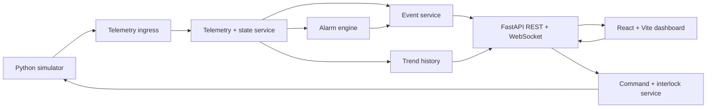

# Mini Grid SCADA Architecture

## 1. Goal

Mini Grid SCADA is a local demonstration platform for low-voltage grid monitoring. It combines:

- simulated telemetry for a transformer, station breakers, and five feeders
- alarm evaluation and event logging
- conservative breaker command handling with interlocks
- replay and incident review
- an operator-focused dashboard for live supervision

It is a portfolio/demo system only. It must never be connected to real electrical equipment.

## 2. Design Principles

1. Backend is the source of truth.
   Alarm state, interlocks, replay history, and command outcomes are decided in the backend, not in the UI.

2. The simulator is replaceable.
   The current simulator runs in-process, but the telemetry shape is designed so it can later be fed from MQTT without rewriting the alarm or dashboard layers.

3. Topology drives the UI.
   The single-line diagram is a view of assets and edges, not a hardcoded sketch detached from the model.

4. Switching is conservative by default.
   All breaker commands require validation, logging, and explicit impact handling.

5. Fast feedback matters.
   The system should feel responsive even when live telemetry, trends, replay, and simulator controls are all active.

## 3. Runtime Architecture

## 4. Main Components

### Backend

The backend owns:

- topology and asset metadata
- latest station snapshot
- alarm lifecycle
- event and command audit trail
- trend aggregation
- replay history
- station and feeder breaker command handling

### Frontend

The frontend focuses on:

- rendering the live operator view
- object selection and drilldown
- trend inspection
- replay navigation
- simulator interaction
- report export initiation

### Simulator

The simulator generates:

- continuous normal profiles
- timed operating overlays
- explicit fault scenarios
- derived feeder and transformer values

It currently runs as a local Python service loop started by the backend.

## 5. Topology Model

The station is modeled explicitly:

- `NST-001` station root
- `BRK-IN` inlet breaker
- `T1` transformer
- `LV-BRK` low-voltage station breaker
- `BUS-01` 0.4 kV busbar
- `F1-F4` outgoing feeders
- `F5` Romstad Kraftverk as a local hydro generation branch

This allows the UI and command layer to reason about:

- supply path to any object
- downstream customer impact
- local generation support and equivalent supplied homes
- feeder-vs-station switching consequences
- energized and de-energized route visualization

## 6. Snapshot Model

Each live snapshot contains:

- station metadata and timestamp
- transformer telemetry
- station breaker telemetry
- feeder telemetry
- derived metrics such as utilization, phase imbalance, voltage deviation, and affected customers

Trend payloads are separated from the main snapshot so the dashboard can stay compact while still supporting richer chart windows.

## 7. Simulation Model

### Normal Profiles

Current baseline profiles:

- `weekday`
- `winter_day`
- `weekend`
- `overcast`

These continuously update load, reactive power, solar contribution, hydro water flow, and load balance.

### Timed Events

Current timed overlays include:

- school start
- lunch break
- EV rush
- cloud front over solar
- evening peak
- heat pump activity

### Fault Scenarios

Current scenario library includes:

- EV peak
- phase imbalance
- communication loss
- breaker trip
- high solar
- hydro low flow
- hydro intake debris
- hydro turbine trip

### Hydro Branch Model

`F5 - Romstad Kraftverk` is modeled as a generation-support branch rather than a normal customer feeder.

It has:

- water flow percentage as an input driver
- available generation derived from water flow
- production setpoint capped by available generation
- homes-equivalent support as an operator-facing derived metric
- hydro-specific alarms and reclose blocking on unsafe intake or low-flow conditions

## 8. Commands and Interlocks

### Feeder Breakers

Feeder switching already supports:

- open with operator reason and impact confirmation
- close with blocking on active faults, degraded telemetry, or unacknowledged critical alarms
- trip-latch behavior for measured overload

### Station Breakers

`BRK-IN` and `LV-BRK` are now modeled as first-class controllable objects.

They influence:

- transformer energization
- busbar availability
- downstream feeder power state
- customer impact summaries
- command previews in the selected-object panel
- branch-by-branch restore preview and “next step” guidance

Closing a station breaker is intentionally conservative and can be blocked by downstream fault state or unsafe restoration conditions.

## 9. Alarm and Event Flow

For each update cycle:

1. The simulator produces a full snapshot.
2. The backend validates and stores the latest state.
3. Alarm rules evaluate against current values and previous alarm state.
4. Event entries are written for alarm transitions, state transitions, and commands.
5. The dashboard payload is broadcast over WebSocket and exposed over REST.

Alarm and event are deliberately different concepts:

- Alarm = current operational state that may need action
- Event = append-only timeline fact

## 10. Trend and Replay Model

Trend history is collected separately from the live snapshot and exposed through `GET /api/trends`.

Current capabilities:

- independent time windows per chart
- phase-specific voltage trends (`L1`, `L2`, `L3`, `all`)
- hover inspection in the UI
- replay timeline with event filters, bookmarks, stepping, slice presets, and jump-to-live

Replay uses recent dashboard frames plus recent events to reconstruct an operator-friendly incident timeline.

Incident slicing is now a first-class frontend concept:

- whole-window review
- short event-centered slices
- longer event-centered slices
- first-alarm-to-now slices

Those slices are reused by both report preview and package export so the operator sees the same scope in replay and reporting.

## 11. Incident Reporting and Shareable Packages

The reporting layer now has two outputs:

- markdown incident report export for readable summaries
- JSON incident package export for replay-aware sharing

The package export includes:

- scope metadata for the selected incident slice
- report preview sections
- markdown report body
- sorted active alarms
- focus assets
- recent timeline entries
- operator notes

This keeps the reporting model portable without needing a backend document pipeline yet.
## 12. Responsiveness and Performance

Current performance choices:

- compact dashboard payload over WebSocket
- backend trend downsampling
- separate trend API for larger windows
- SVG-based diagram for crisp scaling and stateful route rendering
- flat UI state store to avoid unnecessary rerenders

The goal is smooth 2-second live updates without making the UI feel heavy.

## 13. Implemented Status

Implemented in the current version:

- live dashboard
- one-line diagram with feeder and station breaker modeling
- stronger energized/de-energized route continuity in the diagram
- object-centric trends
- replay with bookmarks and incident slices
- incident center with package-ready report preview
- guided station switching drills with restore checkpoints and playbook steps
- simulator profiles, timed events, and fault scenarios
- hydro generation support branch with dedicated controls and alarms
- conservative switching flow and audit trail
- report export

## 14. Near-Term Next Steps

Next development packages:

- richer incident exports with bundled screenshots or attached artifacts
- replay comparison views between live state and sliced incident context
- stronger printable handoff output for operator review
- optional MQTT ingress path after the local core is fully stable
