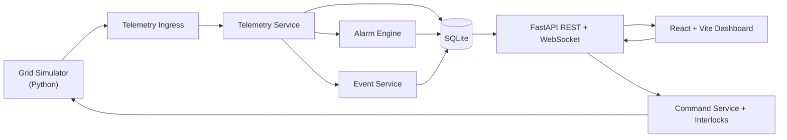

# Arkitekturplan for Mini Grid SCADA Demo

## 1. Mål

Mini Grid SCADA Demo skal være en lokal, kjørbar demonstrator som viser hvordan simulerte nettdata kan bli til operatørinnsikt gjennom:

- telemetri for trafo og fire feeders
- alarmregler med tydelig årsak, konsekvens og anbefalt handling
- hendelseslogg og sporbarhet
- sikre operatørkommandoer med interlocks
- en SCADA-inspirert frontend for oversikt, alarmer, scenarioer og trender

Prosjektet er uttrykkelig en demo. Det skal ikke kobles til eller styre ekte elektrisk utstyr.

## 2. Arkitekturprinsipper

1. Backend er sannhetskilden.
   All alarmtilstand, kommandohåndtering, interlocks og historikk skal avgjøres i backend, ikke i frontend.

2. Simulatoren er utskiftbar.
   MVP skal være enkel å kjøre lokalt, men telemetri-inngang skal designes slik at vi senere kan bytte fra intern/in-process simulering til MQTT uten å skrive om alarmmotoren.

3. Domenemodeller skal være tydelige og delte.
   Python-modeller i backend er kanoniske. Frontend-typer genereres fra OpenAPI eller holdes strengt synkronisert mot samme feltnavn og enum-verdier.

4. Alarmer og hendelser er ikke det samme.
   Alarm er en tilstand som krever oppfølging. Hendelse er append-only historikk.

5. Kommandoer skal være konservative.
   Alle bryterkommandoer må passere interlock-regler og logges med årsak, resultat og tidsstempel.

6. MVP først, OT-realismen etterpå.
   REST og WebSocket er nok i første versjon. MQTT legges til i fase 2 når grunnflyten virker.

7. Topologi før pikselperfeksjon.
   Vi modellerer anlegget som objekter og relasjoner først, og lar GUI være en visning av denne modellen.

8. Alarmstøy skal reduseres, ikke bare vises.
   Alarmmotoren skal på sikt kunne korrelere flere symptomer til én hendelse eller ett sannsynlig rotproblem.

## 3. Målarkitektur



## 4. Hovedbeslutning for MVP

For MVP anbefales følgende kjøremodell:

- `backend` kjører som FastAPI-applikasjon
- `simulator` ligger som egen Python-modul, men startes av backend som en bakgrunnsjobb i utviklingsmiljøet
- frontend kobler seg til backend via REST for initial last og WebSocket for live-oppdateringer
- SQLite brukes til alarmhistorikk, hendelseslogg, kommandohistorikk og enkel trendhistorikk

Dette gir lav kompleksitet i startfasen, men beholder en klar grense mellom domenelogikk og simulatorlogikk.

## 5. Komponenter

### 5.1 Simulator

Ansvar:

- generere normal drift hvert 2. sekund
- kjøre scenarioer som EV-peak, faseubalanse, kommunikasjonstap og brytertrip
- beregne avhengigheter som trafo-last fra feederlast og solproduksjon
- publisere komplette snapshots, ikke bare enkeltpunkter

Viktig designvalg:

- simulatoren skal eie scenario-tilstand
- backend skal eie operasjonell tilstand som alarmer, eventer og interlocks

Direkte styrbare input per feeder i MVP:

- `loadKw`: aktiv last i kW for F1, F2 og F3
- `reactivePowerKvar` eller alternativt `powerFactor`: styrer mer realistisk spennings- og strømrespons
- `phaseImbalancePercent`: gjør det mulig å fordele last skjevt mellom L1, L2 og L3
- `breakerStatus`: åpen, lukket eller tripped
- `communicationState`: good, stale, lost eller invalid
- `faultMode`: for eksempel normal, overload, planned_outage, sensor_fault eller forced_trip
- `solarKw`: produksjon for F4, modellert som eksport ved negativ nettoeffekt

Verdier som helst skal beregnes, ikke styres direkte i normal drift:

- spenning per fase
- strøm per fase
- trafo-last
- vernutnyttelse i prosent
- alarmtilstand
- berørte kunder

Hvis vi senere ønsker en mer “lab-aktig” fault injection-modus, kan vi legge til `voltageOffset` som avansert kontroll. Den bør da merkes tydelig som test- eller feilinjeksjon, ikke som normal operatørkontroll.

### 5.2 Telemetry ingress

Dette er adapterlaget mellom simulator og domenelogikk.

I MVP:

- `InProcessTelemetryAdapter` sender snapshot direkte inn i backend-service

Senere:

- `MqttTelemetryAdapter` kan lese samme snapshot-format fra broker

Ved å innføre et lite adapterlag nå kan vi bytte transport senere uten å endre alarmregler, database eller frontend.

### 5.3 Telemetry service

Ansvar:

- validere snapshot med Pydantic-modeller
- oppdatere `latest`-tilstand per objekt
- skrive historikkpunkter for trendvisning
- kalle alarmmotor og eventtjeneste
- trigge WebSocket-broadcast til frontend

### 5.4 Alarm engine

Alarmmotoren bør implementeres som rene regler over snapshot-data og forrige tilstand.

Regler i MVP:

- underspenning
- overspenning
- faseubalanse
- overlastvarsel
- vern utløst / brytertrip
- høy trafo-temperatur
- kommunikasjon tapt

For hver regel må motoren kunne:

- opprette alarm
- oppdatere alarmstatus
- sette `returnedAt` når normaltilstand er tilbake
- produsere hendelser når status endres

I fase 2 bør alarmmotoren også introdusere enkel alarmkorrelasjon:

- koble relaterte alarmer til en felles `incidentId`
- utpeke et sannsynlig førstesymptom eller rotproblem
- gruppere alarmflom i GUI under én hendelse med flere symptomer

### 5.5 Command service og interlocks

Alle operatørkommandoer skal gå gjennom backend.

Ansvar:

- validere kommandoformat
- slå opp gjeldende objektstatus
- kjøre interlock-regler
- enten blokkere kommandoen eller sende den videre til simulator
- logge både forsøk og resultat

Interlocks i MVP:

- ikke tillat lukking ved aktiv feil
- ikke tillat lukking ved kommunikasjonstap
- ikke tillat lukking ved ukvittert kritisk alarm
- tillat åpning, men krev bekreftelse og årsak

### 5.6 Event service

Event service skal skrive append-only historikk for blant annet:

- simulering startet/stoppet
- scenario startet/nullstilt
- last eller solproduksjon endret
- alarm opprettet, kvittert, returned eller closed
- bryter åpnet, lukket eller trippet
- interlock blokkerte kommando
- kommunikasjon tapt/gjenopprettet
- rapport eksportert

I samme spor skal vi ha et tydelig command audit trail:

- hvem eller hva som initierte kommandoen, for eksempel `operator` eller `scenario`
- kommandoens begrunnelse
- hvilke kunder og objekter som ville blitt berørt
- om kommandoen ble tillatt eller blokkert
- hvilken interlock-regel som eventuelt blokkerte
- tidspunkt for forsøk og endelig resultat

### 5.7 Frontend dashboard

Frontend skal være en operatørflate, ikke et sted for forretningslogikk.

Ansvar:

- vise siste telemetri
- vise aktive alarmer og hendelseslogg
- vise valgt objekt med faner for status, målinger, beskyttelse, kommando og info
- sende brukerhandlinger til backend
- vise interlock-meldinger og konsekvens for kommandoer

Fase 2 og showcase-versjoner av GUI kan i tillegg inkludere:

- incident summary-panel med sannsynlig årsak, påvirkede objekter og anbefalt neste steg
- replay-tidslinje for scenarioavspilling
- datakvalitetsoversikt eller heatmap
- systemhelse for simulator, backend, database, WebSocket og MQTT

### 5.8 Observability og systemhelse

Dette prosjektet blir sterkere hvis vi overvåker selve demo-plattformen, ikke bare nettet.

Vi bør derfor modellere:

- heartbeat fra simulator
- siste telemetri per objekt og data age
- backend-status
- database-status
- antall aktive WebSocket-klienter
- MQTT broker-status når MQTT er introdusert

Denne informasjonen bør vises både i toppfelt og via eget status-endepunkt.

## 5.9 Responsivitet og ytelse

Systemet skal oppleves raskt og stabilt selv om telemetri oppdateres ofte.

MVP-krav:

- telemetrioppdatering hvert 2. sekund uten merkbar UI-lag
- frontend skal være responsiv for både desktop og mindre skjermer
- API og simulator skal starte raskt lokalt uten tung initiering
- dashboardet skal kunne vise siste status selv om historikk eller replay lastes separat

Arkitekturvalg for å støtte dette:

- backend sender et kompakt, normalisert dashboard-objekt over WebSocket
- frontend holder state flat og oppdelt etter visningsbehov, slik at små endringer ikke rerendrer hele siden
- tunge visninger som trend/replay lastes via egne kall i stedet for å være del av hvert live-snapshot
- derived metrics beregnes i backend slik at frontend holder seg lett
- simulatoren jobber med preberegnede profiler og enkel matematikk, ikke tunge analyser per tick
- SQLite-skriving for historikk kan batches eller nedsamples hvis oppdateringstakten senere øker

## 6. Domenemodell

Følgende modeller bør være sentrale:

- `Asset`
- `StationTopology`
- `StationSnapshot`
- `TransformerTelemetry`
- `FeederTelemetry`
- `ProtectionSettings`
- `Alarm`
- `Incident`
- `Event`
- `CommandRequest`
- `CommandResult`
- `InterlockDecision`
- `ScenarioState`
- `ScenarioRun`
- `DerivedMetrics`
- `SystemHealth`

Anbefaling:

- behold Pydantic-modeller i `backend/app/models.py` eller `backend/app/domain/models.py`
- generer frontend-typer fra backend OpenAPI når strukturen stabiliseres

Topologimodellen bør være eksplisitt:

- `Asset` beskriver objektet, for eksempel trafo, feeder, bryter eller samleskinne
- `StationTopology` beskriver relasjoner mellom objekter
- GUI sitt enlinjeskjema skal leses fra denne modellen i stedet for å være hardkodet

Derived metrics bør beregnes i backend:

- utnyttelse i prosent
- spenningsavvik i prosent
- faseubalanse i prosent
- import eller eksport per feeder
- estimerte berørte kunder ved utkobling

## 7. Dataflyt

Normal flyt for hver oppdatering:

1. Simulator genererer et komplett snapshot.
2. Snapshot valideres i telemetry service.
3. `latest`-tilstand oppdateres for trafo og feeders.
4. Historikkpunkt skrives for relevante trendserier.
5. Alarmmotor evaluerer snapshot mot regler og tidligere tilstand.
6. Nye hendelser og alarmoverganger skrives til database.
7. Oppdatert status sendes til frontend via WebSocket.

Flyt for kommando:

1. Frontend sender kommando til backend.
2. Command service sjekker interlocks.
3. Ved blokkering returneres forklaring til GUI og hendelse logges.
4. Ved godkjenning oppdateres simulatoren.
5. Simulator sender neste snapshot.
6. Backend evaluerer konsekvens, alarmer og hendelser.

Flyt for replay og hendelsesanalyse i fase 2:

1. Et scenario kjøres og lagres som `ScenarioRun`.
2. Snapshot-strøm og hendelser knyttes til scenarioet.
3. Frontend kan laste scenarioet på nytt via replay-API.
4. Brukeren kan pause, spole og inspisere alarmsekvensen steg for steg.

## 8. Persistens

SQLite er riktig for MVP. Det holder prosjektet enkelt og testbart.

Anbefalte tabeller:

- `assets`
- `topology_edges`
- `telemetry_latest`
- `telemetry_history`
- `alarms`
- `incidents`
- `alarm_transitions`
- `events`
- `command_log`
- `scenario_runs`
- `scenario_snapshots`
- `derived_metric_history`

Forslag til datapraksis:

- `assets` og `topology_edges` beskriver anleggsmodellen som frontend kan tegne
- `telemetry_latest` inneholder siste snapshot per objekt
- `telemetry_history` lagrer sampling for trendgrafer, for eksempel hvert 2. sekund eller nedsamplet til 5 sekunder
- `incidents` grupperer relaterte alarmer og støtter root-cause-visning
- `events` er append-only
- `command_log` må kunne lagre blokkert/tillatt, årsak, påvirkning og interlock-regel
- `alarms` inneholder siste tilstand, mens `alarm_transitions` brukes for full historikk
- `scenario_runs` og `scenario_snapshots` gir grunnlag for replay

Når SQLite begynner å bli en begrensning kan vi gå til PostgreSQL uten å endre API-kontraktene.

## 9. API-plan

REST for kommandoer og historikk, WebSocket for live-oppdateringer.

REST-endepunkt i MVP:

- `GET /api/status`
- `GET /api/topology`
- `GET /api/telemetry/latest`
- `GET /api/telemetry/history?objectId=F3&minutes=60`
- `GET /api/alarms/active`
- `POST /api/alarms/{id}/acknowledge`
- `GET /api/events?limit=100`
- `POST /api/commands/open-breaker`
- `POST /api/commands/close-breaker`
- `POST /api/simulator/set-load`
- `POST /api/simulator/set-solar`
- `POST /api/simulator/start-scenario`
- `POST /api/simulator/reset`
- `GET /api/report/latest`
- `POST /api/report/export`

Fase 2 og showcase-endepunkt:

- `GET /api/health`
- `GET /api/incidents/active`
- `GET /api/scenario-runs`
- `GET /api/scenario-runs/{id}`
- `GET /api/scenario-runs/{id}/replay`

WebSocket-kanaler i MVP kan holdes enkle:

- `/ws/dashboard` sender samlet dashboard-payload

Det er bedre å sende ett normalisert dashboard-objekt først enn å splitte opp i mange små strømmer for tidlig.

## 10. Frontend-struktur

Anbefalt frontend-oppdeling:

- `src/types.ts`: genererte eller manuelt synkroniserte typer
- `src/api.ts`: REST-klient og WebSocket-klient
- `src/state/useTelemetryStore.ts`: siste dashboard-data, alarmer, events
- `src/state/useScenarioStore.ts`: scenario- og kontrolltilstand
- `src/state/useReplayStore.ts`: replay-tidslinje og valgt tidspunkt
- `src/components/TopBar.tsx`
- `src/components/AlarmList.tsx`
- `src/components/EventLog.tsx`
- `src/components/IncidentSummary.tsx`
- `src/components/SingleLineDiagram.tsx`
- `src/components/SelectedObjectPanel.tsx`
- `src/components/ReplayTimeline.tsx`
- `src/components/SimulatorPanel.tsx`
- `src/components/TrendCharts.tsx`
- `src/components/StatusFooter.tsx`

Frontend-state bør være normalisert rundt:

- valgt objekt-ID
- siste snapshot
- aktive alarmer
- siste hendelser
- pågående kommando/status

## 11. Backend-struktur

Følgende struktur balanserer enkelhet og ryddighet:

```text
backend/
  app/
    main.py
    config.py
    api/
      routes_status.py
      routes_telemetry.py
      routes_alarms.py
      routes_commands.py
      routes_simulator.py
      routes_reports.py
      ws.py
    domain/
      models.py
      enums.py
      alarms.py
      interlocks.py
    services/
      telemetry_service.py
      alarm_service.py
      incident_service.py
      event_service.py
      command_service.py
      health_service.py
      simulator_service.py
      report_service.py
    repositories/
      asset_repository.py
      telemetry_repository.py
      alarm_repository.py
      incident_repository.py
      event_repository.py
      command_repository.py
    database.py
  tests/
    test_alarm_rules.py
    test_interlocks.py
    test_scenarios.py
```

Hvis du vil holde første iterasjon enda enklere, kan `api`, `domain` og `services` være flate moduler i `app/` og deles opp når MVP er fungerende.

## 12. Anbefalt repo-struktur

```text
mini-grid-scada/
  README.md
  docker-compose.yml
  docs/
    architecture.md
    utility_relevance.md
    alarm_philosophy.md
    screenshots.md
  backend/
  simulator/
  frontend/
  sample_data/
```

`simulator/` kan enten være egen toppmappe eller et Python-package som importeres av backend. For MVP anbefales toppmappe i repoet, men med kode som kan startes via backend.

## 13. Leveransefaser

### Fase 1: grunnmodell og simulator

- opprett mapper og basisprosjekter
- implementer domene-typer for asset, topologi, trafo, feeder, alarm og event
- legg verninnstillinger og terskler i config-filer, ikke som hardkodede tall
- lag simulator for normal drift og snapshot hvert 2. sekund

### Fase 2: backend og alarmer

- bygg `GET /api/telemetry/latest`
- bygg `GET /api/topology` og enkel systemstatus
- implementer alarmmotor og aktive alarmer
- legg inn derived metrics som utnyttelse, ubalanse og berørte kunder
- lag append-only hendelseslogg
- persister alarmer og eventer i SQLite

### Fase 3: frontend operator dashboard

- bygg toppfelt, alarmvisning, eventlogg og enlinjeskjema
- vis valgt objekt med målinger og beskyttelse
- vis datakvalitet, data age og systemhelse
- koble frontend til WebSocket og REST

### Fase 4: kommandoer og interlocks

- implementer åpne/lukke bryter
- blokker lukking ved aktive feil eller dårlig datakvalitet
- logg alle kommandoer og interlock-beslutninger i audit trail
- beregn konsekvens og berørte kunder før kommando bekreftes

### Fase 5: scenarioer, trender og rapport

- legg inn EV-peak, faseubalanse, kommunikasjonstap, brytertrip og høy solproduksjon
- legg til trendgrafer
- ta opp scenario runs og lag grunnlag for replay
- eksporter enkel rapport som JSON først, PDF/HTML senere

### Fase 6: showcase og differensiering

- legg til incident summary med sannsynlig årsak og påvirkede objekter
- grupper relaterte alarmer via enkel alarmkorrelasjon
- bygg replay-tidslinje for hendelsesforløp
- vurder operator training mode som scorer respons på scenarioer

## 14. Nyttige tillegg og showcase-funksjoner

Nyttige tillegg vi bør prioritere tidlig fordi de styrker kjernen:

- eksplisitt topologimodell for assets og relasjoner
- config-drevne grenser og verninnstillinger
- command audit trail med tillatt eller blokkert resultat
- derived metrics som utnyttelse, ubalanse og berørte kunder
- observability for simulator, backend, database og telemetrikvalitet

Showcase-funksjoner som kan imponere uten å late som vi kjenner andre systemers interne funksjonalitet:

- incident replay med tidslinje
- incident summary eller root-cause-panel
- alarmkorrelasjon som demper alarmflom
- operator training mode
- auto-generert hendelsesrapport
- datakvalitet-heatmap eller statusoversikt

I portfolioen bør disse beskrives som ekstra analyse- og treningsfunksjoner bygget oppå en SCADA-inspirert kjerne, ikke som påstander om hva Tensio har eller ikke har.

## 15. Teststrategi

Mest verdi i starten får vi fra backend-tester.

Prioritet:

1. Enhetstester for alarmregler
2. Enhetstester for interlocks
3. Scenario-tester som verifiserer alarmsekvenser
4. API-tester for kvittering, kommandoer og status
5. Frontend-komponenttester kun for de mest kritiske visningene

Alarmregler og interlocks bør designes som rene funksjoner eller svært små services slik at de er enkle å teste deterministisk.

Ekstra viktige testtemaer i fase 2 og showcase:

- at alarmkorrelasjon ikke skjuler kritiske enkelthendelser
- at replay viser samme sekvens som original kjøring
- at audit trail er komplett for både tillatte og blokkerte kommandoer

## 16. Risikoer og bevisste avgrensninger

Risikoer:

- for mye frontend-design før domenelogikken virker
- uklare grenser mellom simulator og backend
- alarmtilstand implementeres implicit i UI i stedet for eksplisitt i backend
- for mye OT-protokollambisjon i MVP

Bevisste avgrensninger:

- ingen ekte IEC 61850, Modbus eller DNP3 i MVP
- ingen ekte brukerroller eller autentisering i første versjon
- ingen kobling til hardware
- ingen auto-styring uten eksplisitt interlock- og logikkmodell

## 17. Anbefalt neste steg

Første byggesteg bør være:

1. scaffold `backend`, `frontend`, `simulator` og `docs`
2. implementer kanoniske Python-modeller for asset/topologi, snapshot, feeder, trafo, alarm og event
3. legg terskler og vern i enkel config
4. bygg simulator for normal drift og ett scenario
5. eksponer `GET /api/status`, `GET /api/topology` og `GET /api/telemetry/latest`

Det gir oss den raskeste veien til en demonstrerbar ende-til-ende-kjede.
